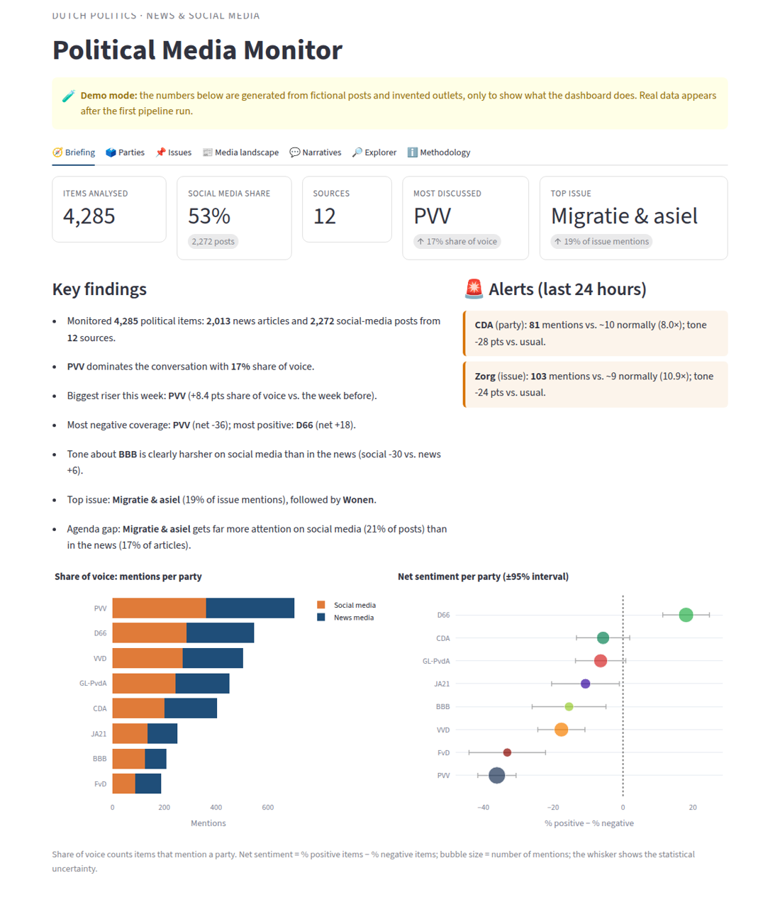
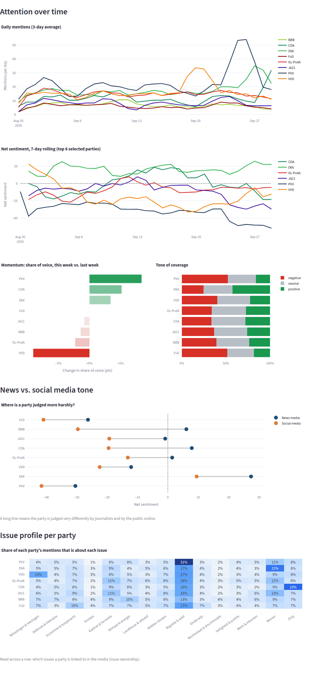
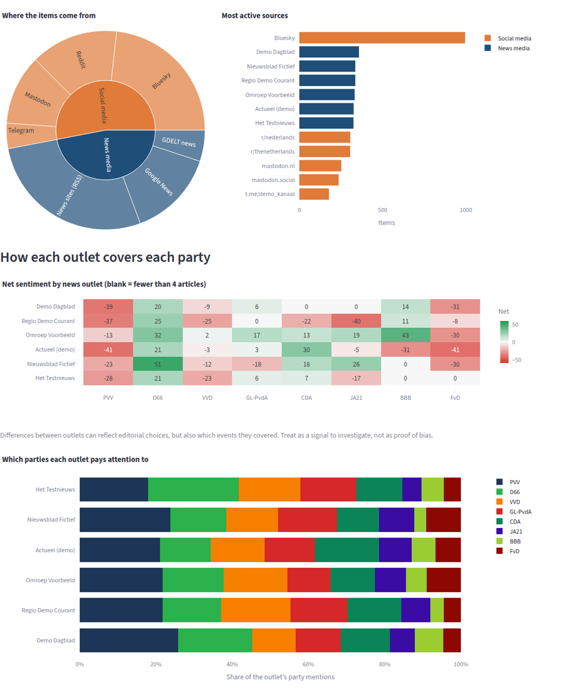

# 🏛️ Dutch Political Media Monitor

**Track how Dutch political parties and issues are covered in the news and discussed on social media, automatically and for free.**

Every 2 hours the monitor collects political news articles and public social-media posts, finds which **parties** and **issues** each one is about, scores its **tone** (positive, neutral or negative) with an AI model, and shows the result in a dashboard. The dashboard covers:

- **Who gets the attention:** share of voice per party, in the news and on social media
- **How they are judged:** net sentiment per party with uncertainty ranges, and the news-vs-social tone gap
- **What the agenda is:** top issues, which issues each party "owns", and what social media talks about that the news doesn't
- **What is happening now:** automatic alerts when a party or issue suddenly spikes, plus emerging words and phrases
- **Who says what:** tone of each news outlet towards each party, the most-engaged posts and the latest headlines



---

## 🌐 Sources: all free

| Channel | Source | How | Account needed? |
|---|---|---|---|
| 📰 News | **40+ outlets:** NOS, Nieuwsuur, NU.nl, de Volkskrant, Trouw, AD, NRC, RTL Nieuws, Telegraaf, FD, BNR, ND, RD, EW, FTM, GeenStijl, TPO, De Groene, all 13 regional broadcasters (Omroep Brabant, NH Nieuws, RTV Utrecht, …), Rijksoverheid, Tweede and Eerste Kamer | Official RSS feeds | No |
| 📰 News | **Google News** (hundreds of outlets, incl. regional) | Public RSS search: one per party, politician and issue plus ~85 topic searches, and the Binnenland section | No |
| 📰 News | **GDELT** (global news database) | Free public API, 250 articles per search plus broad searches on Dutch sources | No |
| 💬 Social | **Bluesky** | Official public API, one search per party and issue | Free Bluesky account (app password) |
| 💬 Social | **Mastodon** (mastodon.nl, toot.community, mastodon.social, …) | ~50 public hashtag timelines + the whole local timeline of mastodon.nl and toot.community, paged back to the previous run | No |
| 💬 Social | **Reddit** (r/thenetherlands, r/nederlands, r/ik_ihe, city subs, …) | Free Reddit API: newest posts, comments and search (RSS fallback, usually blocked from cloud servers) | Free Reddit app (`REDDIT_CLIENT_ID/SECRET`) |
| 💬 Social | **Telegram** public channels | Public web preview (t.me/s/…) | No |
| 💬 Social | **YouTube** (~60 channels: broadcasters, talk shows, parties, regional) | Channel RSS feeds | No |
| 💬 Social | **YouTube comments** *(optional)* | YouTube Data API v3: newest comments on the newest videos | Free API key (`YOUTUBE_API_KEY`) |
| 💬 Social | **X / Twitter: accounts** | Recent posts of ~35 politicians, parties and newsrooms via X's public embed service | No |
| 💬 Social | **X / Twitter: search** *(optional)* | Browser scraper with your login cookies, run on your own computer (see below) | Your X account ⚠️ |

All sources are set in [`config/sources.yaml`](config/sources.yaml). Add or remove outlets, subreddits, hashtags, Telegram channels or YouTube channels there. If one source is down, the others still run. To see which feeds work, run **Actions → "Check sources" → Run workflow** (or `python -m monitor.pipeline probe`): it lists the items per feed/channel for the last 24 hours and every failed URL, without storing anything.

> ⚠️ **About X:** X has no free API. Two free routes are built in:
> 1. **Accounts (automatic, in the cloud).** `x_profiles` in `config/sources.yaml` reads the latest posts of the listed accounts through the same public service that powers embedded X timelines on news sites. No login, but accounts only, not search, and X may throttle it.
> 2. **Search (logged-in browser).** The pipeline opens a real browser window on a virtual screen and searches X like a person. If X still shows its "Even geduld..." wall to GitHub's servers, set the repository variable `X_IN_CLOUD` to `false` and run the same scraper from your own computer (below). It logs in with your browser cookies, which is against X's terms and can get the account locked, so use a secondary account.
>
> **X on your own computer (free, about 10 minutes once):**
> 1. Install [Node.js 22](https://nodejs.org) and [Python 3.11+](https://www.python.org) on a computer that is often on.
> 2. GitHub → your repository → **Settings → Actions → Runners → New self-hosted runner**. Follow the commands it shows for your system. When it asks for labels, type `x-home`. Start it (`./run.sh`, or install it as a service so it starts with the computer).
> 3. Add the secrets `X_AUTH_TOKEN` and `X_CT0` (from x.com: DevTools → Application → Cookies) if you have not yet.
> 4. **Settings → Secrets and variables → Actions → Variables**: add `X_HOME_RUNNER` = `true`.
>
> From then on **"X search from your own computer"** runs every 2 hours while the computer is on, and its posts appear on the website like every other source. Turn it off by deleting the variable.

---

## ▶️ Try it in 2 minutes (demo, nothing to set up)

```bash
git clone https://github.com/Shehab89/XNL_Dashboard.git
cd XNL_Dashboard
python -m pip install -r requirements.txt
python -m streamlit run dashboard/dashboard.py
```

With no data yet, the dashboard shows **fictional demo data** (clearly marked, with invented outlets) so you can explore every chart.

## 🖥️ Collect real data on your own computer

```bash
python -m monitor.pipeline run
python -m streamlit run dashboard/dashboard.py
```

This collects the last 48 hours from all free sources into `data/items.parquet` and analyses it. Without the AI model installed, the tone comes from a built-in Dutch word list: fast, but less accurate. For the AI model:

```bash
python -m pip install torch --index-url https://download.pytorch.org/whl/cpu
python -m pip install -r requirements-model.txt
```

For the best sentiment and topic labels, set `GEMINI_API_KEY` (Google Gemini, models `gemini-2.5-flash`, then `gemini-2.5-flash-lite`, `gemini-flash-latest` and `gemini-flash-lite-latest` as each free daily quota runs out) or `ANTHROPIC_API_KEY` (Claude): the LLM then decides for every candidate item whether it is about Dutch politics, which parties and issues it covers, and its sentiment (the prompt is in `monitor/llm.py`). Set `LLM_MODEL` to pick another model. Without a key, or when a call fails, the local model and word list are used.

For Bluesky, copy `.env.example` to `.env` and fill in `BSKY_HANDLE` and `BSKY_APP_PASSWORD`.

---

## ☁️ Run it automatically, 24/7 and free

The full setup uses three free services: **GitHub Actions** collects every 2 hours, **Supabase** stores the data, and **Streamlit Community Cloud** hosts the dashboard.

**1. Supabase (database)**
1. Create a free project at [supabase.com](https://supabase.com).
2. Open **SQL Editor**, paste [`database/schema.sql`](database/schema.sql) and click **Run**.
3. From **Project Settings → API**, copy the *Project URL*, the *anon* key and the *service_role* key.

**2. GitHub secrets** (repo → **Settings → Secrets and variables → Actions → New repository secret**)

| Secret | Value | Required? |
|---|---|---|
| `SUPABASE_URL` | Project URL | ✅ |
| `SUPABASE_SERVICE_ROLE_KEY` | service_role key | ✅ |
| `BSKY_HANDLE`, `BSKY_APP_PASSWORD` | Bluesky login + app password | Recommended |
| `YOUTUBE_API_KEY` | Free key from the [Google Cloud console](https://console.cloud.google.com/): create a project, enable **YouTube Data API v3**, then **Credentials → Create credentials → API key**. Adds viewers' comments (1 quota unit per 100 comments, 10,000 free a day) | Recommended |
| `REDDIT_CLIENT_ID` + `REDDIT_CLIENT_SECRET` | Reddit blocks anonymous requests from GitHub servers. Create a free app at [reddit.com/prefs/apps](https://www.reddit.com/prefs/apps) (type **script**, any redirect URI); the ID is under the app name, the secret is labelled "secret". Adds posts **and comments** from the Dutch subreddits | Recommended |
| `X_AUTH_TOKEN`, `X_CT0` | X cookies (DevTools → Application → Cookies → x.com) (used by the home runner, see "X on your own computer") | Optional |

Then go to **Actions → "Political Media Monitor" → Run workflow** to start the first collection. After that it runs by itself every 2 hours. The sentiment model runs inside GitHub Actions, which is free for public repos, so no Hugging Face key is needed.

**One-off: the past year.** Run the same workflow once with **backfill_days = 365**. It collects Google News week by week, GDELT (last three months) and Mastodon hashtag history, slowly and with random pauses so the sources do not block it (about 3–4 hours). If a source starts refusing, it stops and logs the date to resume from; run it again with **backfill_until** set to that date. Backfilled items first get keyword + sentiment-model labels; every regular run then spends the AI quota it has left on relabelling them (`LLM_BACKLOG`, default 1500 per run).

**3. Dashboard on Streamlit Cloud**
1. At [share.streamlit.io](https://share.streamlit.io), click **New app**, choose this repo and the main file `dashboard/dashboard.py`.
2. Under **Advanced settings → Secrets**, add:
   ```toml
   SUPABASE_URL = "https://xxxx.supabase.co"
   SUPABASE_KEY = "your-anon-key"     # the public read-only key, NOT the service_role key
   ```

---

## 📊 How to read the dashboard

| Tab | What it shows |
|---|---|
| **🧭 Briefing** | Key numbers, auto-written key findings, **alerts** for spikes in the last 24 h, share of voice and net sentiment per party |
| **🗳️ Parties** | Attention and tone over time, momentum (who is rising), tone split, **news vs. social tone**, and each party's **issue profile** |
| **📌 Issues** | The political agenda, the **agenda gap** (news vs. social), issues over time, and tone per issue |
| **📰 Media landscape** | Where items come from, most active sources, **each outlet's tone towards each party**, and which parties each outlet covers |
| **💬 Narratives** | Most used and **emerging** words and phrases per party or issue, the most-engaged posts, and the latest headlines |
| **🔎 Explorer** | Search and filter every item, open the original, download as CSV |
| **ℹ️ Methodology** | How everything is measured, and the caveats |

<p> </p>

**The key terms:**
- **Share of voice:** a party's mentions as a percentage of all party mentions. *"PVV 17%"* means 17 of every 100 party mentions are about the PVV.
- **Net sentiment:** % positive items minus % negative items, from −100 to +100. *−20* means clearly more negative than positive coverage. The whisker shows the uncertainty: fewer mentions means a wider whisker.
- **Alert:** a party or issue got at least 2 standard deviations more mentions in the last 24 hours than normal (compared with the previous 2 weeks).
- **Agenda gap:** the share of social posts about an issue minus the share of news articles about it.

**Use it responsibly.** Sentiment measures the tone of the text, not support for a party. Social media isn't representative of voters. Differences between outlets are signals to investigate, not proof of bias. The Methodology tab explains more.

---

## ⚙️ Customise

- **Parties, politicians, seats, cabinet and issue keywords:** [`config/entities.yaml`](config/entities.yaml) is the single source of truth. After every run the pipeline re-tags politicians in the database when this file changed and rebuilds the website snapshot, so an edit here reaches the website on the next run (or right away with `python -m monitor publish`). Names that are also normal Dutch words, like *Klaver* or *DENK*, go under `exact:` so they only match with the right capitals.
- **Sources:** [`config/sources.yaml`](config/sources.yaml).
- **Sentiment model:** set `SENTIMENT_MODEL` (default [`cardiffnlp/twitter-xlm-roberta-base-sentiment`](https://huggingface.co/cardiffnlp/twitter-xlm-roberta-base-sentiment)), or `SENTIMENT_BACKEND=api` to use the free Hugging Face API with `HUGGINGFACE_API_KEY` instead.
- **Schedule:** the `cron` line in [`.github/workflows/daily_pipeline.yml`](.github/workflows/daily_pipeline.yml).

## 🗂️ Project structure

```
config/entities.yaml    Parties (aliases, leaders, colours) and issues (keywords)
config/sources.yaml     News feeds, social sources, search settings
monitor/collectors.py   Free collectors: RSS, Google News, GDELT, Bluesky, Mastodon, Reddit, Telegram, YouTube
monitor/nlp.py          Party/issue detection and sentiment (AI model, HF API, or Dutch word list)
monitor/insights.py     All metrics: share of voice, net sentiment, alerts, agenda gap, emerging terms, …
monitor/storage.py      Supabase or local Parquet file
monitor/pipeline.py     Command line: run / demo / queries
monitor/demo.py         Fictional demo data
dashboard/dashboard.py  The Streamlit dashboard
scraper/                Optional X scraper (Node.js + Playwright)
database/schema.sql     Supabase table
tests/                  Automated tests (run: python -m pytest)
```

## 💶 Cost

| Service | Free tier | Used for |
|---|---|---|
| GitHub Actions | Unlimited for public repos (2,000 min/month for private) | Collection + AI analysis every 2 h |
| Supabase | 500 MB database | Storage (items older than 180 days are removed automatically) |
| Streamlit Community Cloud | Free public apps | Dashboard |
| All data sources | Free | See the sources table above |
